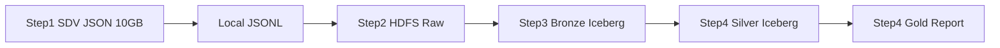

# Financial Medallion Pipeline

SDV synthetic financial JSON → HDFS → Ozone Iceberg (Bronze/Silver/Gold).

## Flow



| Step | Action | Location |
|------|--------|----------|
| 1 | SDV generate ~10GB JSON | `data/output/financial/*.jsonl` |
| 2 | Upload to HDFS | `hdfs://ns1/prod/raw/financial/transactions` |
| 3 | Spark ingest JSON | `ofs://ozone1782570080/prod/data/brnz/transactions` |
| 4 | ETL to report tables | `slvr/` + `gld/` |

## Iceberg Tables

| Layer | Table | Ozone Path |
|-------|-------|------------|
| Bronze | `spark_catalog.sbi_financial.brnz_transactions` | `.../brnz/transactions` |
| Silver | `spark_catalog.sbi_financial.slvr_transactions` | `.../slvr/transactions` |
| Gold | `spark_catalog.sbi_financial.gld_daily_report` | `.../gld/daily_transaction_report` |

## Ranger paired policies (Cloudera CDP 7.3.1 + SBI naming)

Each Iceberg table on Ozone needs **Hadoop SQL (`cm_hive`) + `cm_ozone`** policies per [Cloudera docs](https://docs.cloudera.com/cdp-private-cloud-base/7.3.1/iceberg-how-to/topics/iceberg-ozone-policy.html):

| Table | cm_hive SQL | cm_hive URL | cm_ozone key |
|-------|-------------|-------------|--------------|
| `brnz_transactions` | `dev_brnz_transactions_db_plcy` | `dev_brnz_transactions_uri_plcy` | `dev_data_brnz_key_plcy` |
| `slvr_transactions` | `dev_slvr_transactions_db_plcy` | `dev_slvr_transactions_uri_plcy` | `dev_data_slvr_key_plcy` |
| `gld_daily_report` | `dev_gld_daily_report_db_plcy` | `dev_gld_daily_report_uri_plcy` | `dev_data_gld_key_plcy` |

Infrastructure: `dev_volume_plcy`, `dev_data_bucket_plcy`. Plus cluster **Storage Handler** (iceberg, RW Storage). See [Ranger Iceberg–Ozone Pairs](../operations/ranger-iceberg-ozone-pairs.md).

```bash
bash scripts/security/print_ranger_iceberg_pairs.sh
```

## Ranger (required)

All HDFS, Ozone, and Hive/Iceberg access must be granted via **Apache Ranger** for `systest@...`.  
Do not use filesystem ACLs. See [Ranger Authorization](../operations/ranger-authorization.md) and `governance/configs/security/ranger.yaml`.

## HDFS encryption (required)

HDFS raw ingest path uses **TDE** via **Encryption Zone** with Ranger KMS key **`hdfs_encryption_key`**.  
Create zone: `hdfs crypto -createZone -keyName hdfs_encryption_key -path /{env}/raw/financial/transactions`  
Run first: `bash scripts/infrastructure/setup_hdfs_encryption_zone.sh`  
See [HDFS Encryption](../operations/hdfs-encryption.md).

## Ozone encryption (required)

All Ozone Medallion data uses **TDE** with Ranger KMS key **`ozone_encryption_key`**.  
Create bucket: `ozone sh bucket create -k ozone_encryption_key {env}/data`  
See [Ozone Encryption](../operations/ozone-encryption.md).

## Run (Gateway Node)

### Option A: Airflow (recommended)

```bash
source config/env.conf
export SBI_ENV=prod

bash scripts/airflow/deploy_dags.sh
bash scripts/airflow/import_variables.sh
airflow dags trigger sbi_financial_medallion
```

DAG: `sbi_financial_medallion` — daily 02:00 (configurable via Airflow Variable `schedule_financial_medallion`)

See [Airflow Runbook](../operations/airflow-runbook.md) (CDP Gateway)  
Local install: [Airflow Local Install](../operations/airflow-local-install.md)

### Option B: Manual one-shot

```bash
source config/env.conf
export SBI_ENV=prod

bash scripts/pipeline/run_financial_pipeline.sh
```

### Option C: Step-by-step

```bash
python3 data_gen/generate_financial_json.py --target-gb 10
bash scripts/data/upload_to_hdfs.sh
bash scripts/submit/spark_submit.sh migration \
  --py-file jobs/migration/hdfs_json_to_bronze_job.py \
  --project sbi_financial --job hdfs_json_to_bronze
bash scripts/submit/spark_submit.sh etl \
  --py-file jobs/etl/bronze_to_report_job.py \
  --project sbi_financial --job bronze_to_report
```

## Gold Report Schema

Daily aggregates by `report_date`, `merchant_category`, `channel`, `currency`:

- `transaction_count`
- `total_amount`
- `avg_amount`
- `unique_customers`

Query example (Hue / beeline):

```sql
SELECT report_date, merchant_category, channel,
       transaction_count, total_amount
FROM sbi_financial.gld_daily_report
WHERE report_date >= date_sub(current_date(), 7)
ORDER BY total_amount DESC;
```
